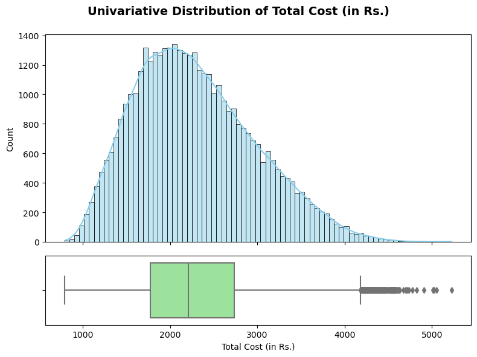
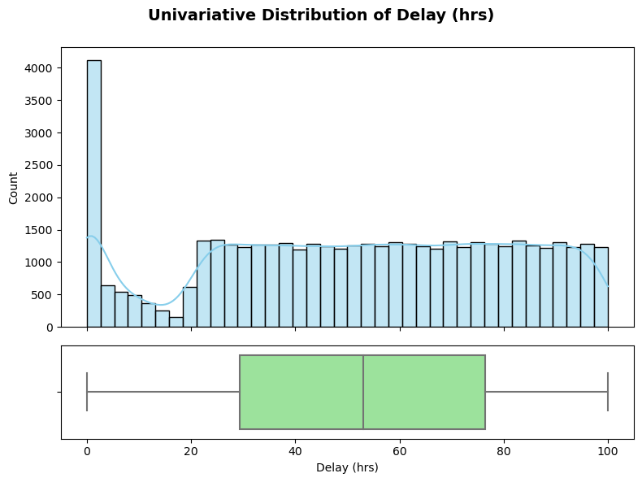
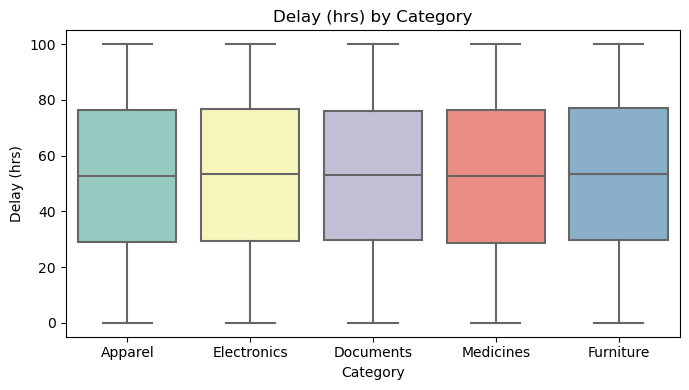
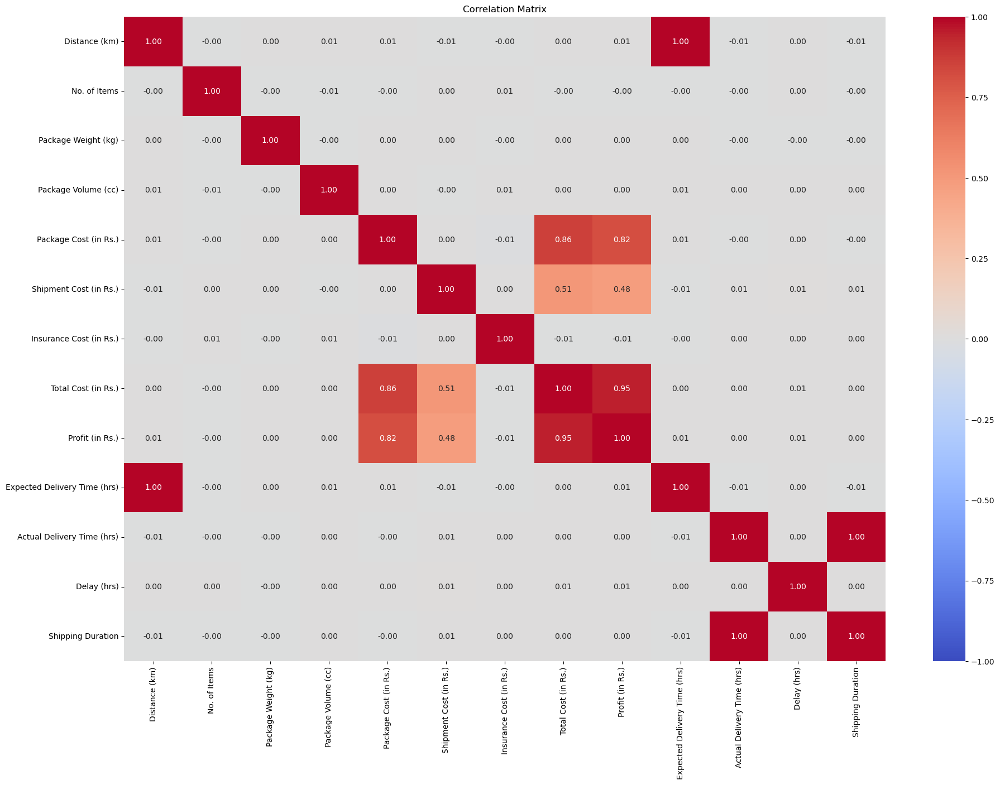

# 🚚 Shipment Analysis — Optimizing Delivery Performance through Data

---

## 📖 Overview / Introduction
In the fast-paced logistics industry, even minor delays can significantly impact customer satisfaction and operational costs.  
The **Shipment Analysis Project** focuses on uncovering insights from shipment data to improve delivery efficiency, reduce delays, and optimize shipping modes.  

The goal is to uncover factors affecting shipment cost, delivery time, and delays through exploratory data analysis (EDA) and feature engineering.

Through this project, I applied my data analytics skills to explore real-world logistics data, clean and visualize it, and derive meaningful business insights to enhance decision-making.


---

## 🎯 Objectives
The main objectives of this project are to:
- Understand shipment performance across various modes and companies.  
- Identify key variables influencing cost, profit, and delays.  
- Engineer new features to prepare the data for future modeling (Part 2).  
- Extract actionable insights to optimize delivery efficiency and cost-effectiveness.

---

## 🧩 Dataset Information
- **Dataset Name:** Shipment_Dataset.csv  
- **Records:** ~50,000  
- **Features:** 15+ columns including shipment cost, distance, mode, weight, and delay  
- **Target Variables:** Delay, Profit, Cost Efficiency  
- **Data Source:** Public logistics dataset (for educational analysis)  

**Key Fields:**
- `Order ID`, `Company`, `Mode`, `Origin`, `Destination`, `Weight`, `Distance`, `Shipment Cost`, `Profit`, `Date of Shipment`, `Delivery Date`, `Delay (Days)`, `Priority`

---

## 🧠 Skills & Tools Used
| Category | Tools / Techniques |
|-----------|-------------------|
| **Programming** | Python |
| **Libraries** | Pandas, NumPy, Matplotlib, Seaborn |
| **Data Analysis** | EDA, Feature Engineering, Correlation Analysis |
| **Visualization** | Histograms, Boxplots, Scatterplots, Heatmaps |
| **Preprocessing** | Missing Value Handling, Encoding, Scaling |
| **Environment** | Jupyter Notebook |

---

## ⚙️ Methodology / Process

### 🧹 1. Data Cleaning
- Removed duplicates and handled missing values.  
- Converted `'Date of Shipment'` and `'Delivery Date'` to datetime format.  
- Derived new column **‘Shipping Duration’** = Delivery Date – Shipment Date.  
- Ensured all numeric fields were in the correct data type.

### 📊 2. Exploratory Data Analysis (EDA)
#### A. Univariate Analysis
- Histograms and boxplots for key metrics such as **Profit**, **Cost**, and **Delay**.  
- Value counts for categorical variables like **Company**, **Mode**, and **Priority**.  





#### B. Bivariate & Multivariate Analysis
- Scatterplots and boxplots to explore relationships (e.g., Cost vs Distance).  
- Correlation heatmap to understand relationships among numeric features.  
- Insights derived on how mode, distance, and weight impact total shipment cost.







### ⚙️ 3. Feature Engineering
- Created **new derived variables** for deeper analysis:
  - `Cost_per_km` = Shipment Cost / Distance  
  - `Cost_per_kg` = Shipment Cost / Weight  
  - `Delay_Category` = Low / Medium / High  
  - `Is_Delayed` = Delay > 0  
  - `Is_Fragile_HighValue` = Interaction between fragility and cost
- Treated outliers using **IQR method** and **Z-score filtering**.  
- Applied one-hot encoding for categorical features like **Mode**, **Priority**, **Company**.  
- Standardized numeric fields for further ML readiness.

### 💼 4. Business Analysis
Explored real-world business questions such as:
- Which company is most cost-efficient per km?  
- Which shipment modes experience the highest delays?  
- Which regions incur the highest logistic costs?  
- Which product categories contribute most to returns or delays?

---

## 📈 Key Insights / Results Summary
✨ **Highlights:**
- **Air mode** offers the quickest delivery but is the most expensive.  
- **Ground mode** has the highest frequency of delays.  
- **Company C** emerged as the most **cost-efficient per km** among all carriers.  
- **High-weight shipments** correlate with increased cost and longer delivery durations.  
- Seasonal spikes in delays were noted in **June and November**.

---

## 📸 Project Preview  
  
*(Example visualization from the analysis — shows delay categories and mode-wise cost distribution.)*

---

## 📊 Results Summary Table

| Metric / KPI | Insight |
|---------------|----------|
| Fastest Shipment Mode | Air |
| Most Delayed Mode | Ground |
| Most Cost-Efficient Company | Company C |
| Average Delay | 2.5 Days |
| Delay Reduction Potential | 15–20% |
| Highest Cost Region | West Zone |
| Correlation (Distance vs Cost) | 0.81 |

---

## 🚀 How to Run the Project

1. **Clone this repository:**
   ```bash
   git clone https://github.com/SaiTejaReddy-Yerra/Shipment_-Analysis.git
